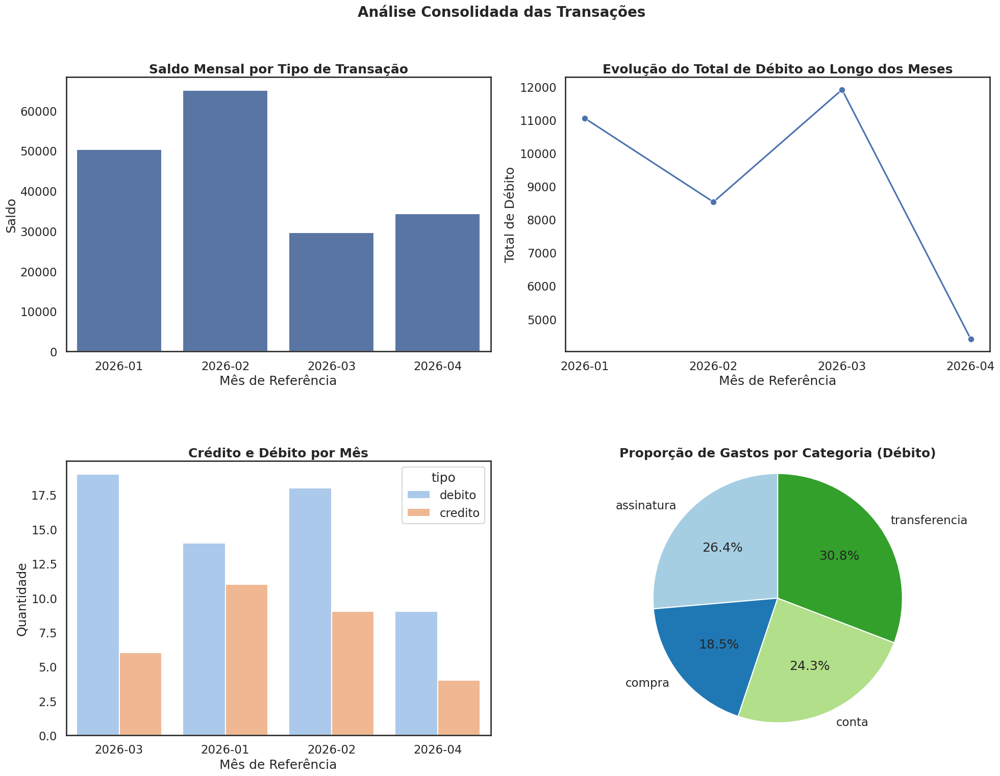

# Análise Financeira com Python - ClearBank

## 1. Descrição do Projeto

Este projeto consiste em um pipeline de processamento e análise de dados de transações financeiras desenvolvido em Python. O sistema é estruturado em um Jupyter Notebook (`.ipynb`) e tem como objetivo realizar a ingestão, limpeza, transformação e agregação de dados brutos provenientes de um arquivo CSV.

O script implementado realiza as seguintes operações técnicas:

- **Ingestão e Sanitização de Dados:** Leitura de arquivos CSV nativa com tratamento de exceções. Filtra e descarta silenciosamente registros com campos nulos, formatos de data inválidos e tipagens numéricas incorretas.
- **Transformação (ETL) e Manipulação de Datas:** Conversão de strings para objetos `datetime`, permitindo a extração de métricas temporais, como o cálculo do período de processamento entre a transação mais antiga e a mais recente.
- **Agregação e Cálculo de Métricas:** Agrupamento de dados em janelas mensais para a computação de KPIs financeiros, incluindo somatório de créditos e débitos, saldo líquido, médias de movimentação e identificação de valores máximos e mínimos.
- **Detecção de Anomalias:** Identificação de transações suspeitas com base em regras de negócio predefinidas (ex: valores acima de R$ 10.000,00).
- **Serialização de Dados:** Exportação dos dados agregados e métricas calculadas para o formato JSON (`relatorio.json`), viabilizando a integração dos resultados com outros sistemas.

O projeto conta também com implementações  utilizando as bibliotecas `pandas` para otimização da manipulação dos dataframes e `matplotlib` para visualização gráfica das métricas.

---

## 2. Configurações e como rodar no Google Colab

Você pode executar os notebooks tanto em um ambiente local usando o Jupyter Notebook quanto na nuvem utilizando o **Google Colab**.

### Parâmetros Configuráveis

Logo no início dos notebooks, existem variáveis de configuração que podem ser customizadas conforme o seu ambiente:

- `CSV_PATH`: Define o caminho para o arquivo de origem dos dados (`transacoes.csv`). O valor padrão é `'/content/transacoes.csv'` (adequado para upload direto na raiz do Colab), mas pode ser modificado para apontar para outros diretórios, especialmente ao rodar localmente.
- `JSON_PATH`: Específico para o arquivo `analise_pandas.ipynb`, define o caminho onde se encontra o relatório previamente gerado (`relatorio.json`). O valor padrão é `'/content/relatorio.json'`, mas pode ser customizado.
- `LIMITE_SUSPEITO`: Define a partir de qual valor uma transação financeira deve ser marcada como anômala. O valor padrão é `10000.00`.

### Passo a Passo: Como rodar o `desafio-final` no Google Colab

1. Acesse o [Google Colab](https://colab.research.google.com/) e faça login com a sua conta Google.
2. No menu principal, vá em **File > Upload notebook** e selecione o arquivo `desafio-final.ipynb`.
3. No menu lateral esquerdo do Colab, clique no ícone de **Pasta (Files)** para abrir o explorador de arquivos do ambiente virtual.
4. Faça o **upload** do arquivo `transacoes.csv` para a raiz deste ambiente. *(Atenção: se você modificou a variável `CSV_PATH`, certifique-se de fazer o upload para o diretório correspondente).*
5. Para rodar a análise completa, vá no menu superior em **Runtime (Ambiente de execução)** e selecione **Run all (Executar tudo)** (Atalho: `Ctrl + F9`).
6. Acompanhe a execução célula a célula. Ao final, os arquivos de saída (incluindo o `relatorio.json`) aparecerão no menu lateral esquerdo. **Lembre-se de baixar ou manter o arquivo `relatorio.json` acessível, pois ele será necessário na próxima etapa.**

### Passo a Passo: Como rodar o `analise_pandas` no Google Colab

**Importante:** A execução do notebook `analise_pandas.ipynb` depende do arquivo `relatorio.json` gerado previamente pelo `desafio-final.ipynb`.

1. Ainda no [Google Colab](https://colab.research.google.com/), vá em **File > Upload notebook** e selecione o arquivo `analise_pandas.ipynb`.
2. No menu lateral esquerdo (Pasta/Files), faça o **upload** de **dois arquivos** para a raiz do ambiente:
   - `transacoes.csv` (dados brutos originais)
   - `relatorio.json` (relatório consolidado gerado na etapa anterior)
   > **Nota de Configuração**: Você pode informar caminhos personalizados alterando as variáveis `CSV_PATH` e `JSON_PATH` na primeira célula do notebook de análise com pandas.
3. No menu superior, vá em **Runtime (Ambiente de execução)** e selecione **Run all (Executar tudo)** (Atalho: `Ctrl + F9`).
4. Acompanhe a execução para visualizar a comparação de dados e performance entre a abordagem Nativa e o uso da biblioteca Pandas.

### Rodando Localmente

Se preferir rodar no seu computador (VS Code ou Jupyter Notebook local), lembre-se de instalar as dependências necessárias para a versão com bibliotecas externas:

```bash
pip install pandas matplotlib
```

---

## 3. Saídas Geradas

Ao executar com sucesso todas as células dos respectivos notebooks, você terá as seguintes saídas:

### Saídas do `desafio-final`

**No Terminal (Console da célula):**

- **Resumo da limpeza de dados:** Quantidade total de linhas lidas, linhas válidas e linhas ignoradas (inválidas).
- **Período de Análise (Periodicidade):** Exibe um resumo detalhado contendo a data da transação mais antiga, a data da transação mais recente e o total de dias transcorridos entre elas.
- **Relatório Financeiro Mensal:** Um extrato formatado para cada mês contendo:
  - Quantidade de transações
  - Total de Crédito e Total de Débito
  - Saldo final do mês
  - Valores da maior e menor transação do período
  - Valor médio por transação
- **Detecção de Transações Suspeitas:** Um alerta será emitido na tela exibindo o ID, Data e Valor de qualquer transação que exceda o limite seguro de R$ 10.000,00.

**Arquivos Gerados:**

- `relatorio.json`: Um arquivo exportado contendo toda a estrutura de análise financeira e as métricas calculadas agrupadas em formato JSON, pronto para ser consumido por outras aplicações (e obrigatório para o próximo notebook).

### Saídas do `analise_pandas`

**No Terminal (Console da célula):**

- **Visualização Tabular:** Apresentação das métricas e dados consolidados utilizando DataFrames do Pandas.
- **Comparativo:** Análise dos dados previamente gerados pelo método nativo importados do JSON contra a modelagem Pandas.

**Gráficos:**

O script `analise_pandas` gera um painel consolidado (`grafico.png`) contendo as seguintes visualizações:

- **Saldo Mensal:** Mostra a evolução do saldo líquido mês a mês.
- **Evolução dos Débitos:** Apresenta a tendência e o comportamento das saídas (débitos) ao longo do tempo.
- **Crédito vs Débito:** Gráfico de barras (empilhadas ou lado a lado) que compara o volume de entradas e saídas.
- **Distribuição Percentual:** Gráfico que ilustra a proporção ou categorização das movimentações financeiras.


